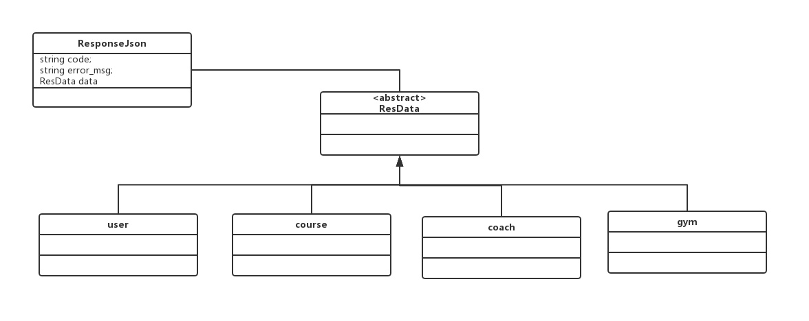

# User
## post /user/signup/
### Parameters
	{
		"username":"",
		"password":"",
		"repasswordd":"",
		"name":"",
		"mail":"",
		"phonenumber":"",
		"age":"",
		"sex":""
	}
### response
code=0 data存在

	{
	"code":0,
	"error_msg":"",
	"data":{
			"username":"",
			"name":"",
			"mail":"",
			"phonenumber":"",
			"age":"",
			"sex":""
			}
	}

## post /user/signin/
### Parameters

	{
		"username":"",
		"password":""
	}

### response

	{
	"code":0,
	"error_msg":"",
	"data":{
			"username":"",
			"name":"",
			"mail":"",
			"phonenumber":"",
			"age":"",
			"sex":""
			}
	}

## post /user/update

### Parameters

	{
		"username":"",
		"oldusername":"",
		"password":"",
		"oldpassword":"",
		"repassword":"",
		"name":"",
		"mail":"",
		"phonenumber":"",
		"age":"",
		"sex":""
	}

### response

	{
	"code":0,
	"error_msg":"",
	"data":{
			"username":"",
			“name”:"",
			"mail":"",
			"phonenumber":""    ,
			"age":"",
			"sex":""
			}
	}

# Course

## get /course/list/{page}/{size}

展示所有course

### Parameters

### response

	{

	"code":0,
	"error_msg":"",
	"data":{
	
	"total":,
	"courselist":
        [
        {
        	"id":"",
        	"name":"",
        	
        	"coachName":"",
        	"coachID":"",
        	
        	"gymName":"",
        	"gymID":"",
        	"address":"",
        	
        	"cost":"",
        	"content:":"",
        	
        	"Time":""
        },
        {
        	"id":"",
        	"name":"",
        	
        	"coachName":"",
        	"coachID":"",
        	
        	"gymName":"",
        	"gymID":"",
        	"address":"",
        	
        	"cost":"",
        	"content:":"",
        	
        	"Time":""
        },
	    ...
	    ]
	  }
	}
	
## 改： get /course/show/{id}

### Parameters
	{

	}
	
### response
	{
	"code":0,
	"error_msg":"",
	"data":
	{
		"id":"",
		"name":"",
		"coach":
				{
					"id":"",
					"name":"",
					"sex":"",
					"age":"",
					"phoneNumber":"",
					"mail":"",
					"content":""
				},
		"gym":
			{
				"id":"",
				"name":"",
				"address":""
			},
		"cost":"",
		"content:":"",	
		"time":""
	}
	}
	
## post /course/user_courses
### Parameters
传入userid或者username
	{
	"username":""
	}
### response
	{
	"code":"",
	"error_msg":"",
	"data":
	[
	{
		"id":"",
		"name":"",
		
		"coachName":"",
		"coachID":"",
		
		"gymName":"",
		"gymID":"",
		"address":"",
		
		"cost":"",
		"content:":"",
		
		"Time":"",
	},
	{
		"id":"",
		"name":"",
		
		"coachName":"",
		"coachID":"",
		
		"gymName":"",
		"gymID":"",
		"address":"",
		
		"cost":"",
		"content:":"",
		
		"Time":"",
	}
	]
	}

## post /course/user_add
### Parameters
传入userid或者username
	{
	"username":"",
	//此id为course_id
	"id":""
	}
### response
    	{
    	"code":"",
    	"error_msg":"",
    	"data":
    	[
    	{
    		"id":"",
    		"name":"",
    		
    		"coachName":"",
    		"coachID":"",
    		
    		"gymName":"",
    		"gymID":"",
    		"address":"",
    		
    		"cost":"",
    		"content:":"",
    		
    		"Time":"",
    	},
    	{
    		"id":"",
    		"name":"",
    		
    		"coachName":"",
    		"coachID":"",
    		
    		"gymName":"",
    		"gymID":"",
    		"address":"",
    		
    		"cost":"",
    		"content:":"",
    		
    		"Time":"",
    	}
    	]
    	}
    	
#coach

## 加： get /coache/list
### Parameters

### response

## 改： get /coache/show{id}
### Parameters

### response
	{
	"code":"",
	"error_msg":"",
	"data":
	{
		"id":"",
		"name":"",
		"age":"",
		"sex":"",
		"phoneNumber":"",
		"mail":"",
		"content":"",
		"courses":
		[
		{
			"id":"",
			"name":"",
			
			"coachName":"",
			"coachID":"",
			
			"gymName":"",
			"gymID":"",
			"address":"",
			
			"cost":"",
			"content:":"",
			
			"Time":"",
		},
		{
			"id":"",
			"name":"",
			
			"coachName":"",
			"coachID":"",
			
			"gymName":"",
			"gymID":"",
			"address":"",
			
			"cost":"",
			"content:":"",
			
			"Time":"",
		},
		...
		]
	}
	}

# gym

## 加： get /gym/list
### Parameters

### response

## 加： get /gym/show{id}
### Parameters

### response
