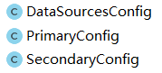

# report_1

----------

[项目部署地址](http://106.15.200.225)（存在用户 username:admin  password:admin）

<!-- TOC -->

- [report_1](#report_1)
    - [1.Basic（待补充 运行截图和描述）](#1basic待补充-运行截图和描述)
        - [1.1 前后端分离设计](#11前后端分离设计)
        - [1.2 数据库设计](#12数据库设计)
        - [1.3 UML设计类图](#13uml设计类图)
        - [1.4 Restful接口设计](#14restful接口设计)
        - [1.5 系统功能](#15系统功能)
    - [2. JPA featues（待补充 运行截图和描述）](#2jpa-featues待补充-运行截图和描述)
        - [2.1 多表联查](#21多表联查)
        - [2.2 多数据库源](#22多数据库源)
        - [2.3 分页查询](#23分页查询)
        - [2.4 审计](#24审计)
    - [3.Web Cache Redis（待补充 运行截图和描述）](#3web-cache-redis待补充-运行截图和描述)
        - [3.1Server_cache Redis（实现缓存加速功能的接口）](#31server_cache-redis实现缓存加速功能的接口)

<!-- /TOC -->

## 1.Basic

### 1.1前后端分离设计

### 1.2数据库设计

设计有4个实体分别为 user course coach gym

+ user与course关系为 ManyToMany
+ course与gym关系为 ManyToOne
+ course与gym关系为 ManyToOne

设计数据表

+ USER(**ID**,AGE,CREATE_AT,MAIL,NAME,PASSWORD,PHONE_NUMBER,ROLE,SEX,UPDATE_AT,USERNAME)
+ USER_COURSE(**USER_ID**,**COURSE_ID**)
+ COURSE（**ID**,TIME,CONTENT,COST,CREATE_AT,NAME,UPDATE_AT,COACH_ID,GYM_ID）
+ COACH（**ID**,AGE,CREATE_AT,MAIL,NAME,PASSWORD,PHONE_NUMBER,ROLE,SEX,UPDATE_AT,USERNAME）
+ GYM（**ID**,ADDRESS,CREATE_AT,NAME,UPDATE_AT）

### 1.3UML设计类图

**Controller设计**

**Service设计**

**Repository设计**

**Response Json设计**

### 1.4Restful接口设计

[RestfulAPI](API_NEW.md)

### 1.5系统功能

+ 登陆
    -

    
    点击网址可以进入登陆页面，有两个输入框，分别输入账号密码可以登陆（内置账号admin/admin）即可以登陆。
+ 注册
    -
    
    在密码输入框下方有一个“注册”小字，用户点击即可以弹出注册的悬浮框，用户填写相关信息后即可以成功注册。
+ 查看用户信息
    -
    
    点击登陆按钮后就会跳转到主页，显示用户在注册的时候所填写的信息，右侧有个课程列表是用户所订阅的课程的简要信息。
+ 查看课程列表课程
    -
     
    点击左侧菜单栏中的课程按键即可以跳转到课程列表页面，用户可以看到全部的课程列表信息，在课程列表下方有分页器，用户可以用此换页。
+ 查看课程详情
    -
    
    用户点击课程列表右侧的详情按钮即可弹出课程的详细信息悬浮窗，里面有课程相关的信息，课程教练的相关信息，课程所在俱乐部位置的相关信息。
+ 订阅课程
    -
    用户可以点击课程列表右侧的订阅按钮来订阅课程，订阅成功则会弹出订阅成功的提示，如果已经订阅过也会有订阅失败的提示。当用户订阅成功后，可以去用户的个人中心查看。

## 2.JPA featues（待补充 运行截图和描述）

### 2.1多表联查

+ 多表联查主要体现在course实体与其他实体之间

+ course实体实现

+ gym实体实现 course与gym为 ManyToOne

+ coach实体实现 course与coach为 ManyToOne

+ user实体实现 course与user为 ManyToMany

### 2.2多数据库源

使用两个基于h2的数据库源 application.properties配置如下

	//datasource 1
	spring.datasource.primary.url =jdbc:h2:mem:db1
	spring.datasource.primary.username = root
	spring.datasource.primary.password = root
	spring.datasource.primary.driverClassName = org.h2.Driver
	spring.datasource.primary.data=classpath:db/data.sql
	//datasource 2
	spring.datasource.secondary.url =jdbc:h2:mem:db2
	spring.datasource.secondary.username = root
	spring.datasource.secondary.password = root
	spring.datasource.secondary.driverClassName = org.h2.Driver
	spring.datasource.secondary.data=classpath:db/data.sql

并且在配置文件中配置相应启动项

### 2.3分页查询

api设计时候加入page和size选项

    @Cacheable(value = "courseList")
    @RequestMapping(value = {"/list/{page}/{size}","/courses/{page}/{size}/"})
    @ResponseBody
    public ResponseJson getCourses(@PathVariable Integer page, @PathVariable Integer size)
    {
    
    	return courseService.getCourseList(page,size);
    }

数据库查询时候返回分页查询结果

     PageRequest pageSet = PageRequest.of(page, size);
     Iterable<Course> courses = courseRepository.findAll(pageSet);

### 2.4审计

+ 在数据库实体类中，我们使用了JPA的审计功能，此功能可以自动记录条目创建和修改的时间戳。

## 3.Web Cache Redis

### 3.1Server_cache Redis

+ 查看课程列表
    -
    在函数前添加注解
    @Cacheable(value = "courseList")、
    系统自动生成键值对存入redis缓存中，加速数据的查询。
    
    
+ 查看课程详情
    -
    在函数前添加注解
    @Cacheable(value = "courseInfo", key = "#id")
    系统根据课程id作为键存入redis缓存中，加速数据的查询。
