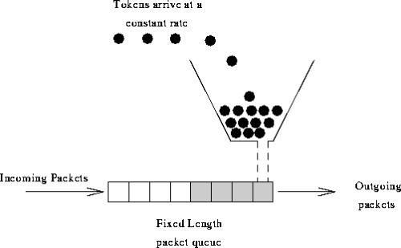

# report_2

----------

[项目部署地址](http://106.15.200.225)（存在用户 username:admin  password:admin）

<!-- TOC -->

- [report_2](#report_2)
    - [1.Basic](#1basic)
        - [1.1前后端分离设计](#11前后端分离设计)
        - [1.2数据库设计](#12数据库设计)
    - [2.Rate Limiting](#2rate-limiting)
        - [2.1 Guava 限流](#21-guava-限流)
        - [2.2 Nginx 限流](#22-nginx-限流)
    - [3. API设计](#3-api设计)
        - [3.1 RESTFul风格设计](#31-restful风格设计)
    - [4.Online API Doucument](#4online-api-doucument)
        - [4.1 Swagger的使用](#41-Swagger的使用)    	
    - [5.Oauth Authetication](#5oauth-authetication)
    - [6.Cache](#6cache)
        - [6.1 Redis Cache](#61-redis-cache)
        - [6.2 Http cache](#62-http-cache)
    - [7.Hateos](#7hateos)

<!-- /TOC -->

## 1.Basic

### 1.1前后端分离设计

### 1.2数据库设计

[更多基础设计 见report_1 Basic部分](report_1.md)

## 2.Rate Limiting

### 2.1 Guava 限流

- 在我们的项目中实现了一个名为AccessLimitService的类，
这个类中定义了令牌的生成情况。我们定义每秒钟产生0.2个令牌即
每五秒可以获得一个令牌。

- 我们在获取课程列表的接口（因为我们认为这个接口的开销最大，应该
添加限流）中调用了获取令牌的函数。

- 代码如下

		//尝试获取令牌
		if(accessLimitService.tryAcquire()){
			return courseService.getCourseList(page,size);
		}else{

			ResponseJson responseJson = new ResponseJson();
			responseJson.setCode(-1);
			responseJson.setData(new ResData() {
				private String error_msg = "access limit";
			});
			return responseJson;
		}

### 2.2 Nginx 限流

+ limit_req_zone 用来限制单位时间内的请求数，即速率限制,采用的漏桶算法 “leaky bucket” 

+ limit_req_conn 用来限制同一时间连接数，即并发限制 

具体配置为:
	
	limit_zone one $binary_remote_addr 20m;
	limit_req zone = req_one burst=130;
	linit_req_zone $limit zone=req_one:20m rate=20r/s;
	limit_conn one 15;

## 3. API设计

### 3.1 RESTFul风格设计

[sportClub API Version1.0](API_V1.md)

## 4.Online API Doucument

### 4.1 Swagger的使用
+ 对Swagger2进行类的配置和修改

+ 使用Swagger2对Controller进行注解来生成注释

+ 生成的相关controller文档

## 5.Oauth Authetication

+ 对课程list资源施行token验证，用户没有从OauthServer获取的token无法访问资源

## 6.Cache

### 6.1 Redis Cache

+ Redis 基本配置

+ 查看课程列表
    
    在函数前添加注解
    @Cacheable(value = "courseList")、
    系统自动生成键值对存入redis缓存中，加速数据的查询。
    
    
+ 查看课程详情
   
    在函数前添加注解
    @Cacheable(value = "courseInfo", key = "#id")
    系统根据课程id作为键存入redis缓存中，加速数据的查询。

### 6.2 Http cache

+ 我们的项目中一些接口实现了对于httpchache的缓存，通过返回和接收
时间戳来使用http cache。
+ 使用了Http cache的接口是RootController下的所有接口

- 当第一次调用course接口的时候在返回的信息的header中有最近修改的时间。
---

- 当第二次访问的时候将时间放入到header中时便不再返回相同的信息。
## 7.Hateos

当用户访问固定路径`/` `/user` `/course` `/coach` `gym`时候返回连接：

返回json类图为：

