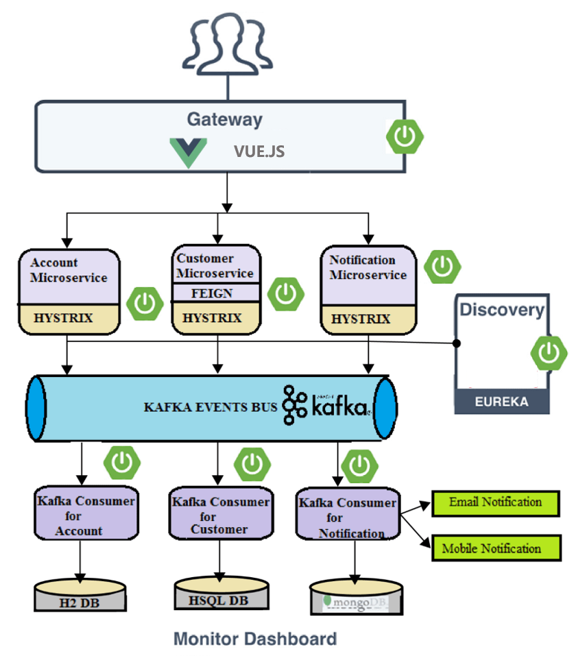

# report_3

----------

[项目部署地址](http://106.15.200.225)（存在用户 username:admin  password:admin）

<!-- TOC -->

- [Report_3](#report_3)
    - [1.Basic](#1basic)
        - [1.1 kafka中间键设计](#11-kafka中间键设计)
        - [1.2数据库设计](#12数据库设计)
        - [1.3部分API重构设计事例](#13部分api重构设计事例)
            - [post api/v1/Kafka/user/signup/handle](#post-apiv1kafkausersignuphandle)
            - [post api/v1/Kafka/user/signup/result](#post-apiv1kafkausersignupresult)
            - [post api/v1/Kafka/course/user_courses/handle](#post-apiv1kafkacourseuser_courseshandle)
            - [post api/v1/Kafka/course/user_courses/result](#post-apiv1kafkacourseuser_coursesresult))
    - [2 kafka构建](#2-kafka构建)
        - [2.1 启动win下的zookeeper](#21-启动win下的zookeeper)
        - [2.2 启动win下的kafka](#22-启动win下的kafka)
        - [2.3 springclound kafka配置](#23-springclound-kafka配置)
        - [2.4 kafka生产者实现](#24-kafka生产者实现)
        - [2.5 kafka消费者实现](#25-kafka消费者实现)
        - [2.6 springboot程序启动，连接到kafka](#26-springboot程序启动连接到kafka)
        - [2.7 客户端发送处理请求](#27-客户端发送处理请求)
        - [2.8 服务器端处理](#28-服务器端处理)
        - [2.9 客户端发送结果请求](#29-客户端发送结果请求)

<!-- /TOC -->

## 1.Basic

### 1.1 kafka中间键设计

### 1.2数据库设计

[更多基础设计 见report_1 Basic部分](report_1.md)

### 1.3部分API重构设计事例

API设计增加了异步处理功能，分为handle和result，handle请求发出后，后端kafka会将处理发送给消费者，处理后将结果存入数据库。此时前端再通过result请求获得请求结果。

#### post api/v1/Kafka/user/signup/handle

#### Parameters
	{"username":"",
		"password":"",
		"repasswordd":"",
		"name":"",
		"mail":"",
		"phonenumber":"",
		"age":"",
		"sex":""
}

#### response
code=0 data存在

	{
	"code":0,
	"error_msg":"",
	"data":{
			}
	}

#### post api/v1/Kafka/user/signup/result

#### Parameters
	{"username":"",
		"password":"",
		"repasswordd":"",
		"name":"",
		"mail":"",
		"phonenumber":"",
		"age":"",
		"sex":""
}

#### response
code=0 data存在

	{
	"code":0,
	"error_msg":"",
	"data":{
			"username":"",
			"name":"",
			"mail":"",
			"phonenumber":"",
			"age":"",
			"sex":""
			}
	}

#### post api/v1/Kafka/course/user_courses/handle
#### Parameters
传入userid或者username
	{
	"username":""
	}

#### response
code=0 data存在

	{
	"code":0,
	"error_msg":"",
	"data":{
			}
	}

#### post api/v1/Kafka/course/user_courses/result
#### Parameters
传入userid或者username
	{
	"username":""
	}
#### response
	{
	"code":"",
	"error_msg":"",
	"data":
	[
	{
		"id":"","name":"","coachName":"","coachID":"",
	     "gymName":"","gymID":"","address":"","cost":"",
	     "content:":"","Time":"",
	},
	{
		"id":"","name":"","coachName":"",
		"coachID":"","gymName":"","gymID":"",
	     "address":"","cost":"","content:":"","Time":"",
	}
	]
	}

## 2 kafka构建

### 2.1 启动win下的zookeeper

	bin\windows\zookeeper-server-start.bat config\zookeeper.properties

### 2.2 启动win下的kafka

	bin\windows\kafka-server-start.bat config\server.properties

### 2.3 springclound kafka配置

	spring.cloud.stream.kafka.binder.brokers.localhost=9092
	spring.cloud.stream.bindings.greetings-in.destination=greetings
	spring.cloud.stream.bindings.greetings-in.contentType=application/json
	spring.cloud.stream.bindings.greetings-out.destination=greetings
	spring.cloud.stream.bindings.greetings-out.contentType=application/json

### 2.4 kafka生产者实现

+ controller接收到请求后将其发送给生产者service。之后由生产者通过消息通道发布消息

### 2.5 kafka消费者实现

+ 消费者端口接收到消息，判断消息内容，调用courseService服务处理消息，并将处理结果存入数据库中

### 2.6 springboot程序启动，连接到kafka

### 2.7 客户端发送处理请求

+ 这个请求含义为给用户admin添加课程id为9的课程

### 2.8 服务器端处理

+ 服务器端生产者的service发出消息到消息队列中

+ 服务器端消费者的service收到消息并处理，将处理结果存入数据库中

### 2.9 客户端发送结果请求

+ 这个请求含义为获取username为admin的所有课程列表，此时 id为9的课程已经被添加到数据库中

